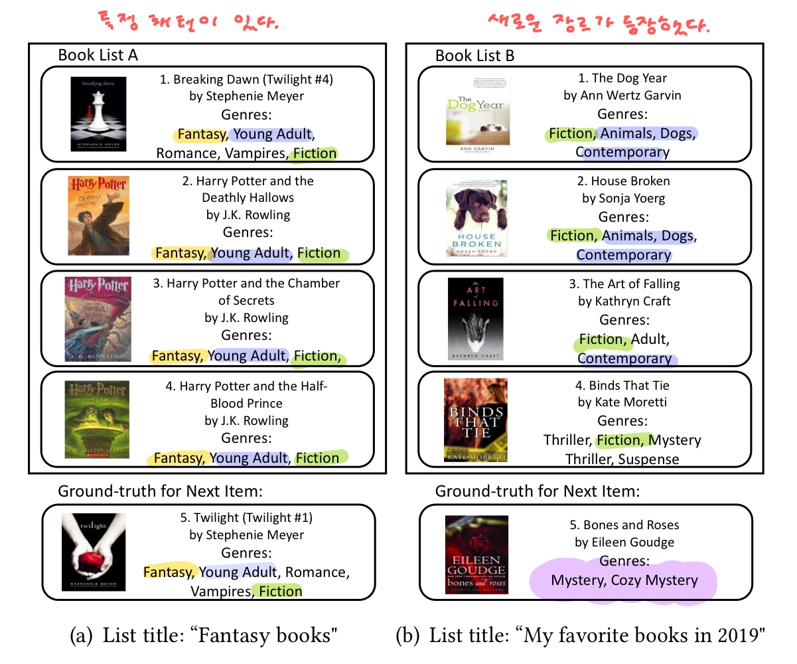

## Consistency-Aware Recommendation for User-Generated Item List Continuation

### ABSTRACT

* 사용자들이 만들어낸 리스트들은 특정 장르나 토픽을 모아놓는 경우도 있는 반면, 개인의 취향을 반영하여 일관성 없는 item을 모아놓는 경우도 있다.
* 위와 같은 현상은 platform(책/노래/비디오)에 따라 다양하지만, 이것과 관계 없는 일반적인 접근 방법을 제안하겠다.
* 우리는 두가지 선호 모델 (1. 사용자의 전반적 선호 2. 사용자의 최근 선호) 을 결합하여 사용자의 선호에 동적으로 적응할 수 있도록 하였다.
* 노래, 책, 질의응답 dataset에 대해 SOTA보다도 효과적임을 증명하였다.
* 모든 코드는 [GitHub](https://github.com/heyunh2015/ListContinuation_WSDM2020)에 공개되어있다.

### SUMMARY

attention을 이용하여 전체적인 선호를 측정하는 모델 (GUPM, General User Prefernce Model)과 최근 선호를 측정하는 모델 (CPPM, Current Preference Priority Model)을 학습시킨다.

### 1. INTRODUCTION

#### Traditional item-based recommendation을 통해서 continuation을 하는 것은 복잡하다.

1. item lists의 길이가 다양하다.
   또한 user가 이 list를 develop할 때, 취향 역시 동적으로 변화할 수 있다.
2. platform에 따라, user에 따라 item을 결합하는 방법(함께 list에 담는 기준)이 다양하다.

* Spotify, Pinterest, Youtube 등의 platform에서는 user들에 의한 item list들이 다수 존재한다.
  함께 담긴 item들은 함께 소비할 가능성이 크다. item 사이의 관계를 확인하는 데에 도움을 준다.
* user-generated item lists는 user들이 직접 생성하고 관리한다.
  이들에게 지속적으로, 그리고 더 빠르게 관리하도록 지시하기 위해서는 *user generated item list continuation*이 필요하다.
* 우리는 다음 세가지 측면에서 아이디어를 얻어 Consistency-aware recommender를 제안하려고 한다.

#### 1. Strongly consistent ? Weakly consistent?

* list마다 일관성이 다르다.

* list가 update되는 양상을 반영하여, 즉 consistency를 반영하여 **동적으로 적응하는 모델**이 필요하다.

#### 2. Consisteny's strong impact on the quality of predicting the next item

* Book List B의 경우, 다음에 user가 보게될 item에 대한 ground truth는 기존 user의 전체 preference에 가까운 것이 아니라 가장 최근에 본 item에 가깝다.
* 즉 사용자 B는 최근에 선호가 변했으므로 이전 정보보다는 가장 최근 정보에 더 비중을 두고 **(ATTENTION)** 다음 item을 추천해주어야 한다.

#### 3. Community norms rather than Superficial similarity

* item의 consistency는 item 자체의 표면적인 속성(음악에서는 audio)이 아니라 실제 user들이 해당 item을 어떻게 결합하느냐와 관련이 있다.
* 만약 많은 user들이 item A,B를 함께 담았다면 표면적으로는 다를지라도 두 item은 비슷하다고 판단해야 한다.

### 3. PRELIMINARIES

#### Measuring Consistency

* 가장 최근에 소비된 item과 나머지 (n-1)개의 item에 대한 similarity의 평균값을 통해 강도를 측정한다.
* 만약 이 average가 크다면 strong consistency, 낮다면 weak
* word2vec을 이용하여 co-occurrence를 측정한다.

#### Observation (platform에 따라 consistency의 dist 역시 다르다.)

* [노래] Spotify : consistency가 다양하다. 즉 취향이 바뀌는 사람과 바뀌지 않는 사람이 비교적 고르게 분포되어있다.
* [책] Goodreads의 경우 대부분이 1을 가진다.

### 4. Proposed Approach

> 전체적인 선호를 측정하는 모델 (GUPM, General User Prefernce Model)과 최근 선호를 측정하는 모델 (CPPM, Current Preference Priority Model)을 학습시킨다.

#### [GUPM] General User Prefernce Model

#### [CPPM] Current Preference Priority Model

---

