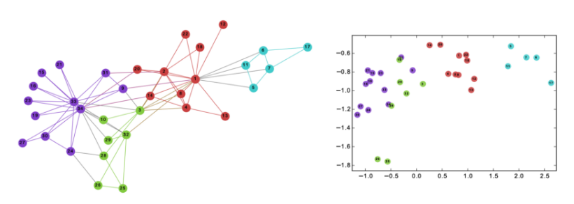
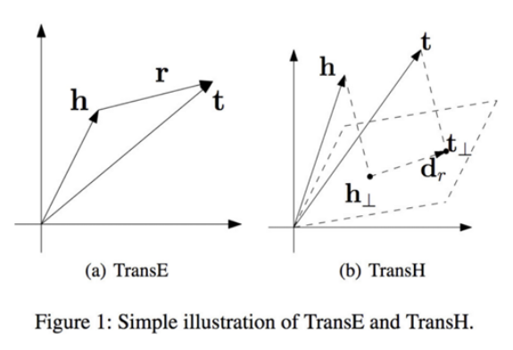
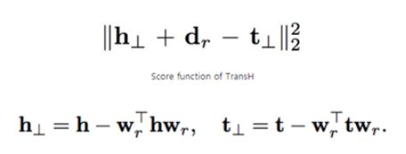
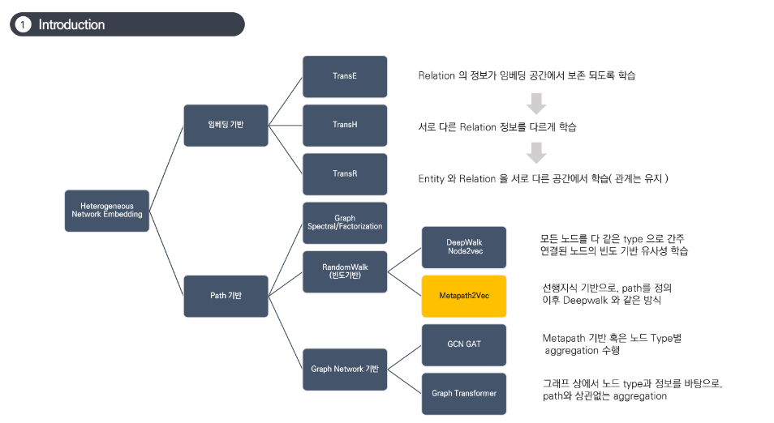
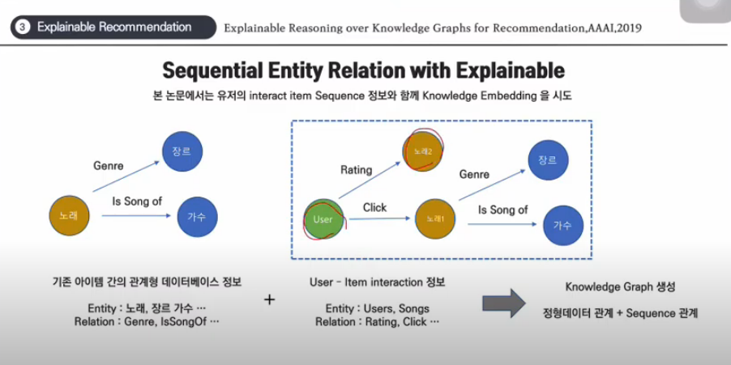
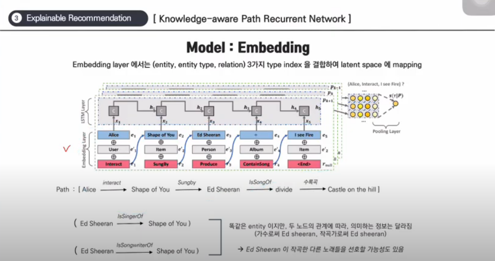
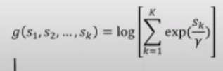
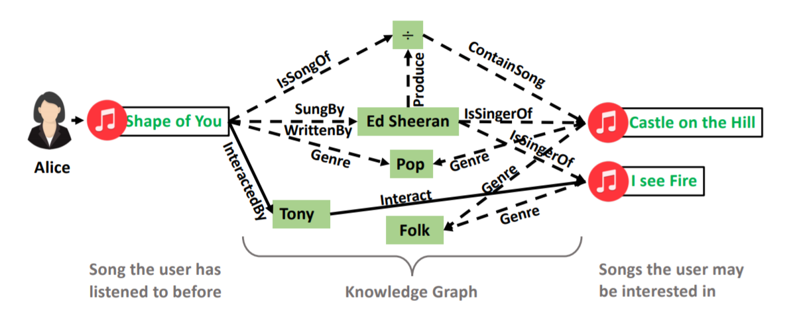

# Knowledge Graph 를 이용한 Recommendation

## What is Knowledge Graph?

entity(head, tail), relation의 tuple으로 표현된 그래프. (같은 head,tail 쌍에 대해 다양한 relation이 정의될 수 있다.)

entity를 node로 두고 relation을 이용해서 edge를 그린다.

ex ) (밤편지, 가수, 아이유) , (밤편지, 작곡가, 제휘)

KG를 기반으로 추천하는 과정을 간단히 나타낸다면, graph의 edge를 타고 가면서 다음과 같은 과정을 거쳐 추천을 하게 됩니다.

user => 이 user가 소비한 item => => 이 item의 특성 => item의 특성을 공유하는 또다른 item => 추천

​                      밤편지                                  가수, 작곡가                 아이유, 제휘를 공유하는 또다른 item을 탐색

## 왜 Knowledge Graph를 이용해서 추천하고 싶은가?

가장 큰 목적은 설명 가능한 추천을 위해서.

MF 등을 통해 latent feature를 얻어 높은 score를 가지는 item을 추천해준다면, 왜 높은 score가 나왔는지 왜 이 item을 추천해주는지에 대한 명확한 이유는 설명하기 어렵다.

그러나 지식 그래프 기반의 추천은 "아이유가 부른 xx는 어떤가요?" / "제휘가 작곡한 xx는 어떤가요?" 등 처럼 사용자에게 추천의 이유를 제공한다.

### 1. Embedding based

> graph embedding을 통해 item feature를 생성하고 이를 통해 추천하자.

**그래프 임베딩이란?**

그래프를 vector space 위에서 representation하기 위한 시도.

Word2Vec의 skip-gram에서 아이디어를 얻어 Graph2Vec 등 여러가지 그래프 임베딩 방법이 존재. [참고](https://medium.com/watcha/%EA%B7%B8%EB%9E%98%ED%94%84-%EC%9E%84%EB%B2%A0%EB%94%A9-%EC%9A%94%EC%95%BD-bc2732048999)

KG-BERT 등 bert를 이용한 embedding을 시도한 논문도 있다.

**1 ) TransE** : || head + relation - tail || 이 0이 되도록 학습시킨다.

tail과 relation이 있는 head는 작아지고 없는 head에 대해서는 위 값이 커지도록 학습시킨다.

loss = max(0, pos-neg)

지코, 아이유 + singer => soulmate

* head와 relation이 주어지면 tail에 매칭되는 entity를 예측할 수 있다.
* 두 entity가 주어지면 그 사이의 relation을 예측할 수 있다.
* 어떤 새로운 entity 2개 또는 entity와 관계를 통해 graph를 채워나갈 수 있다.

그러나 실제로 지코는 힙합을, 아이유는 발라드/댄스 장르.

transE 방법의 embedding은 지코와 아이유가 같은 embedding을 갖도록 학습한다.

2 ) TransH : relation-specific hyperplance에 투영시켜 위와 같은 문제를 해결한다.

### 2. Path based method

여기서의 path란 entity => relation => entity => relation ...을 말한다.

word2vec/skip-gram에서 idea를 얻은 방법론 등이 있다.

DeepWalk => 어떤 type의 entity인지는 고려하지 않고 단순히 연결이 있는지 없는지를 이용한다. 모든 entity가 같은 space 위에서 embedding된다.

Metapath2Vec => entity의 type(배우인지, 영화인지, 감독인지 등)을 고려한다. 같은 배우 space, 영화 space 등 entity type에 따라 embedding 공간이 다르다. 어떤 type의 entity들이 연결되었는지(즉 구조적인 정보)를 통해 meta path을 정의한다. (이를 정의하는 과정에서 domain 지식이 선행되어야 함.)

ex ) 작곡가 - 노래 - 작곡가 (공동 작곡) , 가수 - 노래 - 작곡가, 가수 - 노래 - 작곡가 - 노래 - 가수

1번 방법은 graph embedding시에 user interaction 정보가 반영되지 않는다는 단점이 있고 2번 방법은 domain 지식이 없다면 relation을 정의할 수 없다는 단점이 있다.

# Explainable Reasoning over Knowledge Graphs for Recommendation

트리플 AI 2019

지식 그래프 임베딩을 통해 설명 가능한 추천 모델을 만들자

## 지식 그래프란?

트리플을 그래프로 그려놓은거

이를 통해 추천 시스템을 구축하려는 이유는

1. path를 통해 해당 item을 추천하는 이유를 설명하고 싶다.
2. item embedding을 생성할 때 user들의 interaction 정보가 없더라도 다양한 side information을 통해서 embedding을 하고 서로 다른 entity 사이의 관계를 추론하고 싶다.
3. cold start problem을 해결하고 싶다.

## 요약

* sequential entity relation with explainable
  * 기존에는 관계형 데이터베이스의 정보를 이용해서 collaborative filtering등을 한다.
  * 그러나 여기서는 이 둘의 정보를 통합하여 knowledge graph를 생성한다.
    * user-item interaction 정보를 함께 이용하여 지식 그래프를 생성한다.
    * 

`Knowledge-aware Path Recurrent Network`

* Knowledge Graph의 path를 sequence로 보고 이를 LSTM에 적용하자.

  > meta path는 sequence로 안봤나? 흠

* entity와 relation을 모두 고려한 path representation을 생성할 수 있다.

* path의 sequential한 정보를 활용함으로써 user와 item 사이의 interaction의 근거를 더 잘 추론할 수 있다.

* new weighted pooling operation을 통해 서로 다른 경로의 강점을 구별하고, 이를 통해 설명 가능한 모델을 만들었다.

* movie와 music에 대해 실험하여 두가지 SOTA (2018논문) Collaborative Knowledge Base Embedding and Neural Factorization Machine를 뛰어넘었다.

#### Shape of You를 선호하는 Alice가 Castle on the Hill에는 어떤 반응을 보일까?

##### 1 ) USER Alice가 Castle on the Hill을 선호하게 되는 여러가지 path를 탐색한다.

path 1 = (Alice -> Interact -> Shape of You -> Is Song Of -> ÷(앨범명) -> Contain Song -> Castle on the Hill)

path 2 = (Alice -> Interact -> Shape of You -> Sung by -> Ed sheeran -> IsSingerOf -> Castle on the Hill)

path 3 = (Alice -> Interact -> Shape of You -> InteractedBy -> Tony -> Interact -> Castle on the Hill)

##### 2 ) 가능한 path들이 얼마나 그럴듯 한가? 에 대한 score를 매겨 이를 통해 Castle on the Hill에 대한 score를 매긴다.

가능한 path들이 얼마나 그럴듯한가?에 따라 Alice가 Castle on the Hill을 얼마나 선호하게 될 것인지에 대한 score가 결정된다.

Castle on the Hill로 가는 path가 부자연스럽다면 Alice의 Castle-에 대한 예측 선호도 (즉 score)는 낮게 측정될 것이다.

## Model

파란색은 entity, 회색은 해당 entity의 type, 빨간색은 relation

1. user와 positive item을 설정한다. (Alice, castle on the hill)
2. user와 interaction이 없었던 negative sample도 추출한다.
3. positive path와 negative path를 찾는다.
   * alice와 들은 노래 (1)
   * alice와 다른 노래 (0)
     (negative path는 positive와 같은 path를 가지다가 마지막 item만 interaction이 없는 item을 넣는다?)
   * 당연히 path는 여러개가 가능하다. 모두 LSTM에 통과시킨다.
     ( Alice가 shape of you를 좋아하는 이유가 가수 때문인지 작곡가 때문인지를 파악하고 추후 추천에 이용하고 싶으므로 )
   * 단 window size(path의 길이)를 제한한다. 여기서는 6

### weighted pooling

같은 entity 사이에 여러개의 path가 존재하고 여러개의 vector가 나온다.

만약 path score가 0.3, 0.7, 0.8이 나온 경우

> path 1에 의한 점수가 낮으므로 해당 item에 대한 final score를 낮추어야 할까? 아니면 path 3에 의한 score가 크므로 해당 item에 대한 final score를 높여야 할까?
>
> => 어떤 값으로 나누냐에 따라 달라진다.

score 1부터 k까지가 있으면 얘네를 어떤 수 gamma로 나누고 exp sum을 한 후 log를 씌워준다.

=> gamma가 0에 가까울 수록 max pooling 즉 큰 값에 더 가중치를 준다. 커질 수록 avg pooling

entity, entity type, relation을 concat 시킨다.

LSTM을 통해 이 sequence의 의미와 얼마나 그럴듯한가?를 계산해낸다.

각 item에 대한 score를 계산할 때 weighted pooling layer를 거친다.

* 하나의 item에 대해 여러가지 path가 존재하고, 각각 다른 score를 가지게 된다.
* 이러한 path별로 score에 pooling을 적용한다.
* 각 path별로 어떤 path가 중요하게 작용했는지를 결정하기 위해서.
* 즉 가을아침을 좋아하게 되는 경로는 여러가지가 있겠지만, 가을아침을 좋아하는 이유는 아이유 때문이라는 것을 설명력으로 사용할 수 있게 하기 위함이다.

* shape of you를 소비한 User Alice에게 I see fire를 추천하는 이유를 명확하게 설명할 수 있다.
* (Alice, Interact, Shape of You) => (Shape of You, SungBy, Ed Sheeran) => (Ed Sheeran, IsSingerOf, I See Fire)
  ⇒ **(Alice, Interact, I See Fire)**

기존에 meta-path를 기반으로 한 Path-based method가 있었다. 그러나 다음 두가지 한계에 의해 부적절하다.

1. meta path 방법은 두 entity의 연결에 relation을 내포시킨 것. (즉 edge가 있다면 잠재적인 관계가 있다. 만 말할 수 있을 뿐 실제로 어떤 관계인지는 명시하지 않음). 그러나 같은 head, tail 사이에도 다양한 path가 있을 수 있음. (shape of you와 ca~~ 사이에도 다양한 path가 있는 것 처럼.) => 그런데 단순 연결으로 두 entity를 연결하게 되면 다양한 관계를 고려할 수 없게 됨. 같은 entity라도 다른 관계에 의해 연결될 수 있음. 즉 추천의 이유가 다를 수 있음. 이를 고려하지 못함.
2. 왜냐면 meta path는 domain에 대한 사전 지식이 있어야 한다. 그러므로 자동으로 unseen connectivity pattern을 발견하고 추론하는데에 실패했다. 

Graph Embedding based 방법론도 있었다. 

---

### reasoning의 의미는?

shape of you를 들은 사람에게 castle on the hill을 추천하는 것 자체는 다른 모델도 할 수 있음.

그러나 Alice가 castle on the hill을 선호하는 이유가 에드시런 때문이라는 사실은 KPRN만이 추론 가능함.

Alice가 노래를 듣는 패턴이 다른 item에 대해서도 다 가수에 영향을 많이 받았다면, 앞으로의 추천에서도 가수를 중요하게 고려해야할 것.

이것 때문에 reasoning을 keyword로 둔 것이 아닐까 ...

* 밤편지를 선호한 이유가 가수 때문인지, 작곡가 때문인지를 모두 고려하고 이 과정을 통해서 user가 어떤 attribute를 주로 선호하는지(같은 가수를 찾아 듣는 경향 or 같은 작곡가를 찾아 듣는 경향)에 대한 정보를 찾을 수 있기 때문에 더 잘 추론할 수 있다.

* user interaction을 함께 고려하여 path를 찾기 때문에 CF 기반의 추론 역시 가능하다.

### 한번에 하나밖에 추론을 못하는데 ndcg를 어떻게 계산했다는건가?