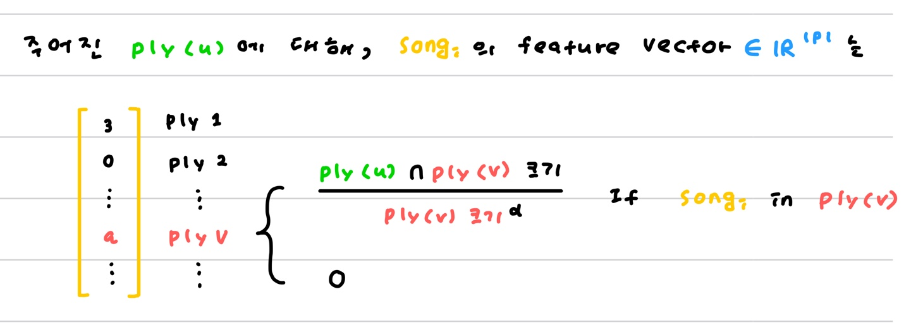
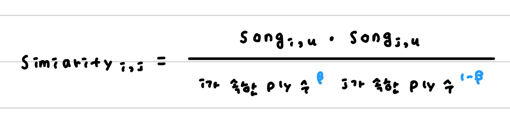
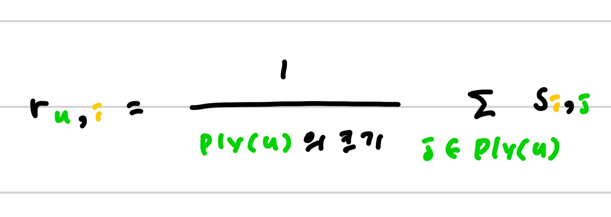

## Neighbor based CF and Discriminative Re-weighting/Re-ranking

:page_facing_up: [Automatic Music Playlist Continuation via Neighbor-based Collaborative Filtering and Discriminative Reweighting/Reranking](https://dl.acm.org/doi/pdf/10.1145/3267471.3267481?casa_token=UvP1zJ-j4u4AAAAA:NOEupgUVc4tZVZ_vk_LFDwss6BkueZHZ2T9v5KH81yLDflE4P5M1iAl7XVMfZjqAsiE_CrcVArZF)

## 3. Our Solution

**Neighbor-based CF의 Main idea**

- `song s`를 포함한 `playlist p`가  `playlist u`와 유사하다면, `playlist u`에게 `song s`를 추천해야한다.
- `playlist p`에 포함된 `song s`와 유사한 `song t`를 `p`에게 추천해야 한다.

🎶 **i-th song의 embedding s{i,u} 구하기**

주어진 playlist u에 대해서, 모든 노래 s의 feature vector를 다음 규칙에 따라 정의한다.

`alpha` ; hyper parameter in [0,1] (control the influence of long playlist)

`song i`가 속한 ply들과 `ply(u)`와의 교집합 점수를 구해서 `song{i,u}`를 만든다.

- 같은 노래를 가지고 있지만 다른 곡은 유사하지 않은 ply의 점수는 낮아지고
- 같은 노래를 가지면서 다른 곡까지 유사한 ply와의 점수는 높아진다.

🎶 **i-th song과 j-th song의 simliarity**

`beta` ; hyper parameter in [0,1]

i는 후보군, j는 target playlist ply(u)에 속한 노래.

🎶 **ply(u)에 대한 i-th song의 최종 rating**

ply(u)에 속한 노래와 후보군 노래 i의 sim을 구한 후, ply(u)의 크기로 나누어 최종 점수로 사용한다.

## 3.3 Discriminative Re-weighting

`r{u,i}` 을 조금 다르게 쓰면 다음과 같은데,

이는 각 차원(ply)마다 얻은 score를 단지 concatenating한 것과 같다.

즉 모든 차원을 같은 무게로 고려한다.

논문에서는 다음 방법을 통해 weight을 학습하였다.

### 👩‍⚖️ L2-regularized Support Vector Classification

SVC를 통해 discriminative aggregation weight `w` in R^P 를 학습하자.

where yi ; indicator ( 1 if i-th song in ply(u) else 0 )

- 만약 i-th song이 ply(u)에 들어있다면 score의 weighted sum이 1에 가까워 지도록 학습되고, 들어있지 않다면 1
- 이렇게 학습된 w는 "적어도 이미 들어있다고 알려진 playlist에게는 높은 점수를" 주는 방향으로 학습되고, L2 Regularization덕분에 trivial solution이 되지는 않는다.

