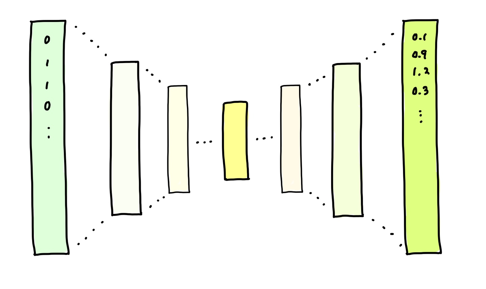
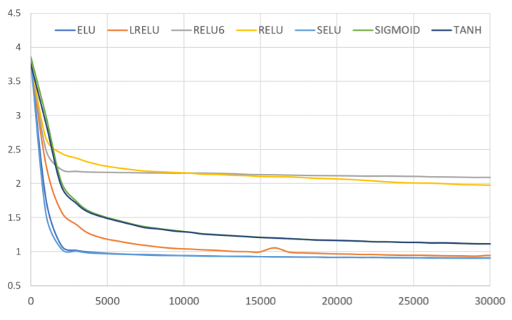
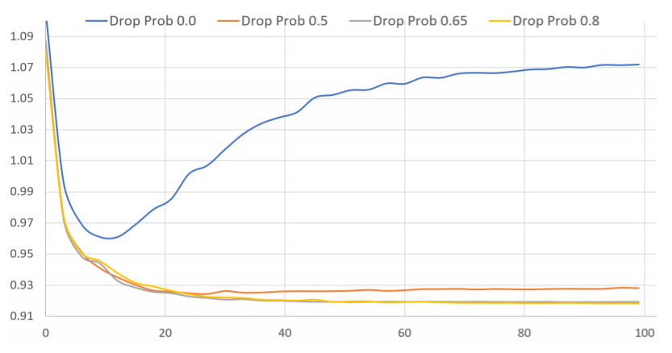

# Training Deep AutoEncoders for Collaborative Filtering


> #### Keywords
>
> `Autoencoder` `selu` `Re-feeding` `Masked MSE` 


## Abstract

End-to-End로 학습된, 6개 layer를 가진 deep autoencoder 구조 (pre training을 하지 않았다 !)

rating prediction task를 위한 모델. 넷플릭스 데이터에서 SOTA를 능가하는 성능을 보였다.


**empirical하게 증명해낸 것**

- 얕은 것보다 deep한 autoencoder일 수록 더 잘 일반화할 수 있다.
- negative한 값을 출력할 수 있는 non linear한 activation functions이 모델 학습에 중요한 역할을 한다.
- dropout등 regularization 테크닉을 heavy하게 사용하는 것이 필요하다.


**Re-feeding**

* 논문에서 제시한 새로운 training 방법

* model output을 다시 input으로 집어넣어 학습시킨다.

* collaborative filtering 시에 sparseness 문제를 극복할 수 있음.

  > model의 output은 실제 데이터보다 dense하므로 dense한 input을 통해 재학습시켜 극복할 수 있다.


## Model

**Autoencoder 빠르게 훑고 가기**



* input과 최대한 비슷한 output을 내도록 학습한다. 즉 output의 target은 input이 된다!
* encoder(x) : R^n^ to R^d^ , decoder(x) : R^d^ to R^n^ 
  encoder의 output인 R^d^ vector가 input에 대한 중요한 정보만 담도록, 이 정보만 있더라도 충분히 input을 복원할 수 있도록 한다.

* 그러므로 잘 학습된 encoder는 PCA와 같은 차원 축소를 위한 tool이 될 수 있다.


### **pre training 없이 더 깊은 모델을 학습시키기 위하여 다음 테크닉을 적용하였다.**

1. **SELU(Scaled Exponential Linear Units)**
   * 만약 activation의 range가 data의 range보다 작다면 decoder의 마지막 layer는 activation하지 않고 linear하게 연결한다.
   * activation f가 non zero negative part를 갖는 것이 굉장히 중요하다는 것을 알아냈기 때문에 selu를 적용하였다.
2. **높은 dropout rate**
3. **Re feeding**


논문에서는 그렇게 하지 않았지만, encoder에서 학습된 weight를 transpose해서 decoder에 사용할 수도 있다.


### LOSS ; Masked MSE

user가 rating하지 않은, 즉 0인 data를 예측하는 것은 합리적이지 않다.

rating된 data에 대해서만 MSE를 측정하는 masked MSE(MMSE)를 Loss로 사용하였다.

rating 여부를 나타내는 mask vector m에 대해 `MSE(pred*m, input)` 을 구하면 된다.

```python
def MSEloss(inputs, targets, size_average=False):
    """
    inputs ; model의 output
    targets ; input
    """
    mask = targets != 0 # 기존에 rating이 있었던 item만 표시하기 위한 mask vector를 생헝하고
    num_ratings = torch.sum(mask.float())
    criterion = nn.MSELoss(reduction='sum' if not size_average else 'mean')
    
    # MSE에 넣기 전 output에 mask를 elementwise하게 곱해줌으로써 0이었던 item에 대한 loss는 계산하지 않게 만든다 !
    return criterion(inputs * mask.float(), targets), Variable(torch.Tensor([1.0])) if size_average else num_ratings
```


### **Re feeding**

만약 Autoencoder가 잘 학습되었다면

어떤 user x가 새로운 item k의 등급을 매기게 되더라도 Autoencoder의 output은 같아야 한다. 즉

`x = [5,0,1,...,0]` 에 대한 `pred = Autoencoder(x)`와

`x* = [5,4,1,...,0]`에 대한 `pred* = Autoencoder(x*)`에 대해 ( x * 은 x에서 x~k~ = 4가 된 vector)

`pred == pred*`을 만족해야 한다.

즉 `Autoencoder(x)` 는 고정된 점을 출력해야하므로, 이 출력값 `pred`를 다시 모델에 넣더라도 역시 `pred`를 뱉어야 한다 !

그러므로 Re feeding을 통해 위 가정을 만족하도록 학습시킨다.


몇 번 Re feeding할 것인지는 코드상에서 `aug_step`으로 구현되어있다.  논문에서는 `aug_step = 1`

```python
if args.aug_step > 0:
	for t in range(args.aug_step):
        ################################ model의 output을 input으로 취급한다 !
		inputs = Variable(outputs.data)
        ################################
		if args.noise_prob > 0.0:
			inputs = dp(inputs)
            
        optimizer.zero_grad()
        
        outputs = rencoder(inputs)
        loss, num_ratings = model.MSEloss(outputs, inputs)
        loss = loss / num_ratings
        
        loss.backward()
        optimizer.step()
```


### 코드로 보는 Architecture

모델 구조가 복잡한 것은 아니기 때문에 코드도 쭉쭉 읽을 수 있다!

```python
class AutoEncoder(nn.Module):
	def __init__(self, layer_sizes, nl_type='selu', is_constrained=True, dp_drop_prob=0.0, last_layer_activations=True):
        
        """
        :param layer_sizes: [n, 1024, 512]를 입력하면 [n > 1024 > 512 > 1024 > n]
        :param nl_type: (default 'selu') non linear activation f중에 어떤 것을 선택할지
        :param is_constrained: (default: True) decoder의 weight도 따로 학습할 것인지(False) 혹은 encoder의 weight를 transpose해서 사용할 것인지(True)
        :param dp_drop_prob: (default: 0.0) Dropout drop probability
        :param last_layer_activations: (default: True) 마지막 layer에도 activation f를 사용할 것인지 ( output의 range를 고려해서 설정하자 ! )
        """
        
       	super(AutoEncoder, self).__init__()
        
        self._dp_drop_prob = dp_drop_prob
        self._last_layer_activations = last_layer_activations
        if dp_drop_prob > 0:
          	self.drop = nn.Dropout(dp_drop_prob)
        self._last = len(layer_sizes) - 2
        self._nl_type = nl_type
        
        # encoder size 설정
        self.encode_w = nn.ParameterList(
          	[nn.Parameter(torch.rand(layer_sizes[i + 1], layer_sizes[i])) for i in range(len(layer_sizes) - 1)])
        
        # xavier 초기화
        for ind, w in enumerate(self.encode_w):
          	weight_init.xavier_uniform_(w)

        self.encode_b = nn.ParameterList(
          [nn.Parameter(torch.zeros(layer_sizes[i + 1])) for i in range(len(layer_sizes) - 1)])

        # decoder의 size는 입력을 거꾸로 하면 된다 !
        reversed_enc_layers = list(reversed(layer_sizes))

        self.is_constrained = is_constrained # True : decoder도 따로 학습, False : encoder에서 학습된 weight 그대로 사용
        if not is_constrained:
            self.decode_w = nn.ParameterList(
                [nn.Parameter(torch.rand(reversed_enc_layers[i + 1], reversed_enc_layers[i])) for i in range(len(reversed_enc_layers) - 1)])
            for ind, w in enumerate(self.decode_w):
            	weight_init.xavier_uniform(w)
                
        self.decode_b = nn.ParameterList(
          [nn.Parameter(torch.zeros(reversed_enc_layers[i + 1])) for i in range(len(reversed_enc_layers) - 1)])

        print("******************************")
        print("******************************")
        
        print(layer_sizes)
        print("Dropout drop probability: {}".format(self._dp_drop_prob))
        
        print("Encoder pass:")
        for ind, w in enumerate(self.encode_w):
          	print(w.data.size())
          	print(self.encode_b[ind].size())
            
        print("Decoder pass:")
        if self.is_constrained:
            print('Decoder is constrained')
          	for ind, w in enumerate(list(reversed(self.encode_w))):
           		print(w.transpose(0, 1).size())
            	print(self.decode_b[ind].size())
        else:
            for ind, w in enumerate(self.decode_w):
            	print(w.data.size())
            	print(self.decode_b[ind].size())
                
        print("******************************")
        print("******************************")


  def encode(self, x):
      for ind, w in enumerate(self.encode_w):
          x = activation(input=F.linear(input=x, weight=w, bias=self.encode_b[ind]), kind=self._nl_type)
    
      # encode의 output에만 drop out을 적용한다.
      if self._dp_drop_prob > 0: # apply dropout only on code layer
          x = self.drop(x)
      return x

  def decode(self, z):
    
      if self.is_constrained:
          for ind, w in enumerate(list(reversed(self.encode_w))): # constrained autoencode re-uses weights from encoder
              z = activation(input=F.linear(input=z, weight=w.transpose(0, 1), bias=self.decode_b[ind]),
                     # last layer or decoder should not apply non linearities
                     kind=self._nl_type if ind!=self._last or self._last_layer_activations else 'none')

      else:
          for ind, w in enumerate(self.decode_w):
              z = activation(input=F.linear(input=z, weight=w, bias=self.decode_b[ind]),
                     # last layer or decoder should not apply non linearities
                     kind=self._nl_type if ind!=self._last or self._last_layer_activations else 'none')
      return z

  def forward(self, x):
      return self.decode(self.encode(x))
```


## Experiments


### 1 ) Activation function의 효과

RELU, Tanh, ELU, leaky RELU 등과 SELU를 비교하였다.

비교를 위한 AE는 4개의 layer, hidden unit의 차원은 128로 설정하였다.

(rating은 1~5점이므로 activation f의 range가 더 작은 sigmoid와 tanh를 사용하는 모델은 마지막 layer를 linear하게 연결했다.)

각 batch마다 RMSE를 그려본 결과 SELU가 가장 준수한 성능을 보였다. 




### 2 ) 높은 Drop out의 효과

encoder의 output, 즉 decoder에 들어가기 전에만 적용된다. (모든 layer에 사용해보았으나 일반화 성능을 향상시키지 못했다.)

drop prob을 낮게 설정했을 때 보다 0.8로 높게 설정했을 때가 더욱 overfitting되지 않는 것을 확인할 수 있다.

drop prob와 epoch에 따라 RMSE를 그린 결과이다.



### 3 ) Dense re feeding의 효과

1. 6 layer `n > 512 > 512 > 1024 > dropout 0.8 > 512 > 512 > n`  model에서 evaluation acc를 향상시켜주었다.

2. 그냥 re feeding을 하는 것은 유의한 영향을 주지 않지만 높은 learning rate를 적용했을 경우에 성능 향상에 유의한 영향을 주었다.

   0.005의 learning rate를 사용하면서 re feeding을 하지 않으면 모델은 발산하기 시작한다 !

3. RMSE가 0.9167에서 0.9100으로 낮아졌으며, 이 중 가장 best인 모델을 이용하여 계산한 test RMSE는 0.9099였다.


## Conclusion

(위에서 정리된 내용은 생략)

위 방법을 item based로도 사용할 수 있으나 이것이 user based보다 실용적이라고 생각하지는 않는다.

만약 실제로 개인화 추천 서비스를 제공하려고 할 때 큰 차원에 대한 문제를 만나게 됐을 때, 차원 축소를 위해서 user를 sampling할 수는 없다.

그러나 item을 sampling하는 것은 수용 가능하다.


---


#### 읽어보면 좋을 다른 리뷰들

* https://soobarkbar.tistory.com/124
* http://samediff.kr/wiki/index.php/Training_Deep_AutoEncoders_for_Collaborative_Filtering#cite_ref-2
